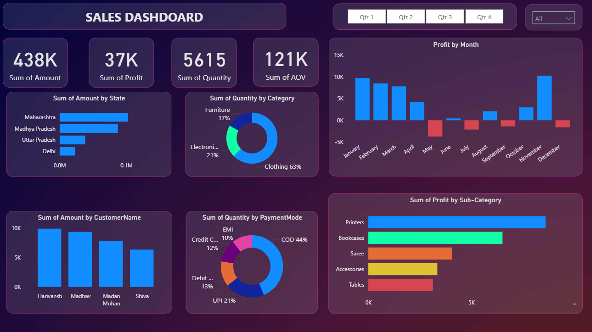

# 📊 Power BI Sales Dashboard

This project contains an interactive Power BI dashboard designed to analyze and visualize online sales data.

## ✅ Features

- **Interactive Dashboard**: Drill-down and cross-filtering features allow users to explore data from high-level overviews to granular details.
- **Slicers for Dynamic Filtering**: Enabled quarter-wise analysis through slicers and dropdowns.

- **Custom Visualizations**: Used a wide range of chart types:
  - Bar Chart
  - Clustered Bar Chart
  - Slicers and Filters

## 🧰 Tools Used

- **Power BI Desktop**

## 📈 Insights Delivered

- 💸 Revenue and profit trends over months
- 🧾 Quantity sold and payment method breakdown
- 🌎 Regional performance (by State)
- 🎯 Top-performing sub-categories and customers
- 📦 Product-wise and category-wise quantity distribution

## 🖼️ Dashboard Preview

### 🔍 Chart Insights

- **Sum of Amount by State**  
  *State-wise sales distribution highlights Maharashtra and Madhya Pradesh as top contributors.*

- **Profit by Month**  
  *Monthly profit analysis reveals seasonal fluctuations, with peaks in January and November.*

- **Sum of Quantity by Category**  
  *Clothing leads in quantity sold, followed by Electronics and Furniture.*

- **Sum of Quantity by Payment Mode**  
  *Cash on Delivery (COD) dominates, followed by UPI and Debit Card.*

- **Sum of Amount by Customer Name**  
  *Top customers by total purchase amount include Harivansh and Madhav.*

- **Sum of Profit by Sub-Category**  
  *Printers and Bookcases yielded the highest profits among all sub-categories.*
